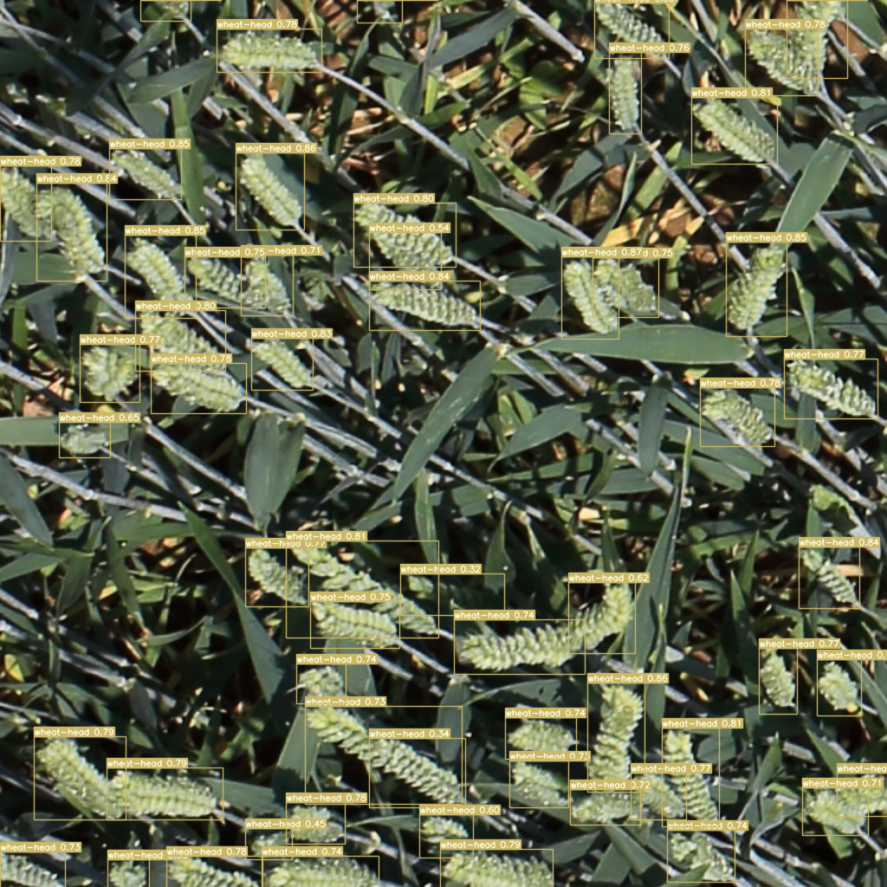
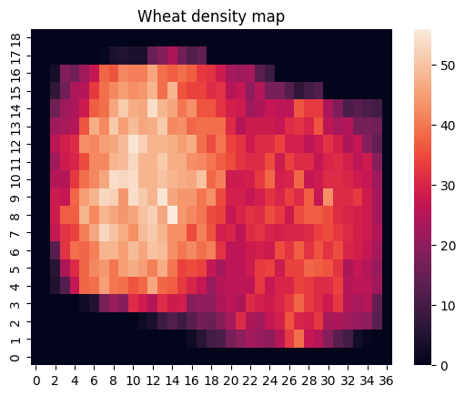

# jszukala-masters-degree-proj
Wheat head detection on GWHD_2021 dataset - PUT masters degree project.

What was done:
- [x] Analyzed and cleaned image data of wheat heads (see [here](https://github.com/JakubSzukala/jszukala-masters-degree-proj/blob/main/data/scripts/data_analysis.ipynb) and [here](https://github.com/JakubSzukala/jszukala-masters-degree-proj/blob/main/data/scripts/data_cleanup.ipynb))
- [x] Prepared Google Cloud based training of the neural network
- [x] Prepared metrics for algorithm evaluation (see [here](https://github.com/JakubSzukala/jszukala-masters-degree-proj/blob/main/model/callbacks.py) and [here](https://github.com/JakubSzukala/jszukala-masters-degree-proj/blob/main/model/utils.py))
- [x] Trained YOLOV7 neural network to detect wheat heads on image data
- [x] Created wheat density map of the area photographed with UAV with use of images’ geolocation and other camera metadata

In the table below are presented training results. Test was performed on GWHD 2020 [test set](https://zenodo.org/record/5092309). M1 is winner model of 2020 competition, M2-M8 are models trained with Yolov7-training library and M9 and M10 are original YOLOV7 implementations from YOLOV7 paper authors.

|     | mAP@0.5:0.75 |                      Remrks                     |
|:---:|:------------:|:-----------------------------------------------:|
|  M1 |     0.689    | GWHD2020 winner 2x Effdet + FasterRCNN ensemble |
|  M2 |     0.573    |         Baseline model, no enhancements         |
|  M3 |     0.684    |                 DA*, k_decay = 2                |
|  M4 |     0.700    |                 DA*, k_decay = 1                |
|  M5 |     0.696    |     DA*, k_decay = 1, Gradient Accumulation     |
|  M6 |     0.482    |         DA*, k_decay = 1, Weights Decay         |
|  M7 |     0.678    |       DA*, k_decay = 1, Domain Upsampling       |
|  M8 |     0.704    |        DA*, k_decay = 1, Pseudo Labeling        |
|  M9 |     0.762    |                 Original YOLOV7                 |
| M10 |     0.749    |               Original YOLOV7-E6E               |

Heat map below presents a density of wheat heads on self collected geolocated images.

###### Disclaimer
This was my masters project and because of time pressure I did cut some corners when it comes to good programming practices and currently I am not willing to sink more time into this project to fix this.